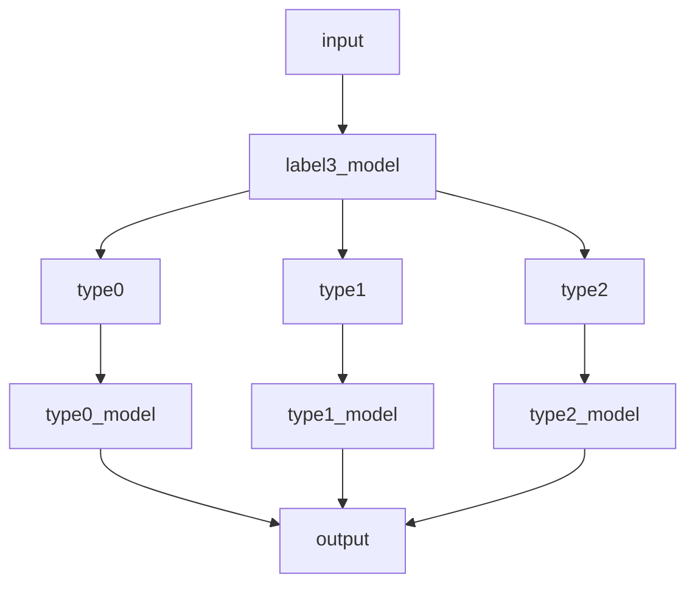

# 데이콘 도배 하자 유형 분뷰 경진대회
도배 하자 유형 분류 AI 경진대회 - DACON

### 배경
한솔데코는 끊임없는 도전을 통해 성장을 모색하고자 하는 기치를 갖고, 공동 주택 내 실내 마감재 공사를 수행하며 시트와 마루, 벽면, 도배 등 건축에서 빼놓을 수 없는 핵심적인 자재를 유통하고 있습니다.
실내 마감재는 건축물 내부 공간의 인테리어와 쾌적한 생활을 좌우하는 만큼, 제품 결함에 대한 꼼꼼한 관리 역시 매우 중요합니다.
이를 위해 한솔데코에서는 AI 기술을 활용하여 하자를 판단하고 빠르게 대처할 수 있는 혁신적인 방안을 모색하고자 합니다.
이미지 데이터를 기반으로 도배의 하자 유형을 정확하게 분류해 낼 수 있는 AI 모델을 개발하세요!

### 주제
도배 하자의 유형 분류 AI 모델 개발

### 설명
총 19가지의 도배 하자 유형을 분류하는 AI 모델을 개발해야합니다.

### 주최/주관   
- 주최 : 한솔데코
- 주관 : 데이콘

## 데이터 설명
train [폴더]
- 19개의 Class 폴더 내 png 파일 존재

test [폴더]
- 평가용 데이터셋 000.png ~ 791.png

test.csv [파일]
- id : 평가 샘플 고유 id
- img_path : 평가 샘플의 이미지 파일 경로

sample_submission.csv [제출양식]
- id : 평가 샘플 고유 id
- label : 예측한 도배 하자 Class

## Environment  
Google Colab pro를 사용하여 대회를 진행하였습니다.
- OS : Ubuntu 20.04.5 LTS
- GPU : Tesla T4
- python == 3.9.16
- torch == 1.13.1+cu116
- torchvision == 0.14.1+cu116
- albumentations == 1.2.1
- scikit-learn == 1.2.2
- timm == 0.9.2

## 대회 전략
19개의 도배 하자 유형 데이터를 확인하였을 때 서로 비슷한 유형의 데이터이거나 생김새가 서로 비슷한 하자 유형의 데이터를 3가지 그룹으로 묶었습니다.  

- type0 - 곰팡이, 녹오염, 반점, 오염
- type1 - 면불량, 석고수정, 오타공, 울음, 이음부불량, 터짐, 훼손, 피스
- type2 - 가구수정, 걸레받이수정, 꼬임, 들뜸, 몰딩수정, 창틀,문틀수정, 틈새과다

Input으로 들어오는 데이터를 type0, type1, type2로 분류하는 label3_model과 3가지 type으로 분류된 데이터를 다시 기존에 정의되있는 class로 분류하는 type0_model, type1_model, type2_model 3가지 모델로 구성하여 대회를 진행하였습니다.

**-공통-**  
- 각 클래스마다 잘못 라벨링된 데이터 제거
- train_test_split : 0.2
- Data argumentation
  - HorizontalFlip
  - ShiftScaleRotate
  - RandomBrightnessContrast
  - RGBShift
  - ColorJitter
  - GaussNoise
  - Normalize
- Efficientnet_v2_m
- Focal Loss
- Label smoothing

**-label3_model, type0_model, type2_model-**  

사전 학습된 Efficientnet_v2_m(pre-trained on ImageNet-in21ft1k)을 사용하여 각 데이터에 맞게 레이어를 추가하여 학습  

**-type1_model-**   

전체 훈련 데이터에서 type1으로 분류한 데이터를 확인해 보았을 때 서로 다른 클래스지만 비슷한 모습을 띠는 클래스들이 존재하고 몇몇 클래스는 데이터의 수가 10개 미만인 데이터도 존재하였기에 다른 모델처럼 학습하는 방식과 다른 방식으로 기존의 feature로는 분류가 쉽지 않았던 데이터에 대해 데이터를 class label 별로 잘 구분할 수 있게 만드는 metric learning을 적용해 보았습니다. 거리 기반 함수를 기반으로 각 클래스의 특징을 잘 나타낼 수 있는 모델을 훈련하고, 이후 모델을 통과한 임베딩 벡터를 통해 K-NN Classifier를 이용해 분류하였습니다.  
- Efficientnet_v2_m(pre-trained on ImageNet-in21ft1k)
- ArcFace module
-  K-NN Classifier

**Summary**
| label3 | type0 | type1 | type2 |
| :---: | :---: | :---: | :---: |
| Efficientnet_v2_m   Focal Loss   Label smoothing   AdamW   OneCycleLR | Efficientnet_v2_m   Weighted random sampler   Focal Loss   Label smoothing   AdamW   OneCycleLR | Efficientnet_v2_m   K-NN Classifier   Weighted random sampler   ArcFace module   Focal Loss   Label smoothing   AdamW   OneCycleLR | Efficientnet_v2_m   Weighted random sampler   Focal Loss   Label smoothing   AdamW   OneCycleLR | 

**그 외 시도들**
- Weighting in Loss Function - Class Weight
- Asymmetric Loss
- Contrastive Loss

